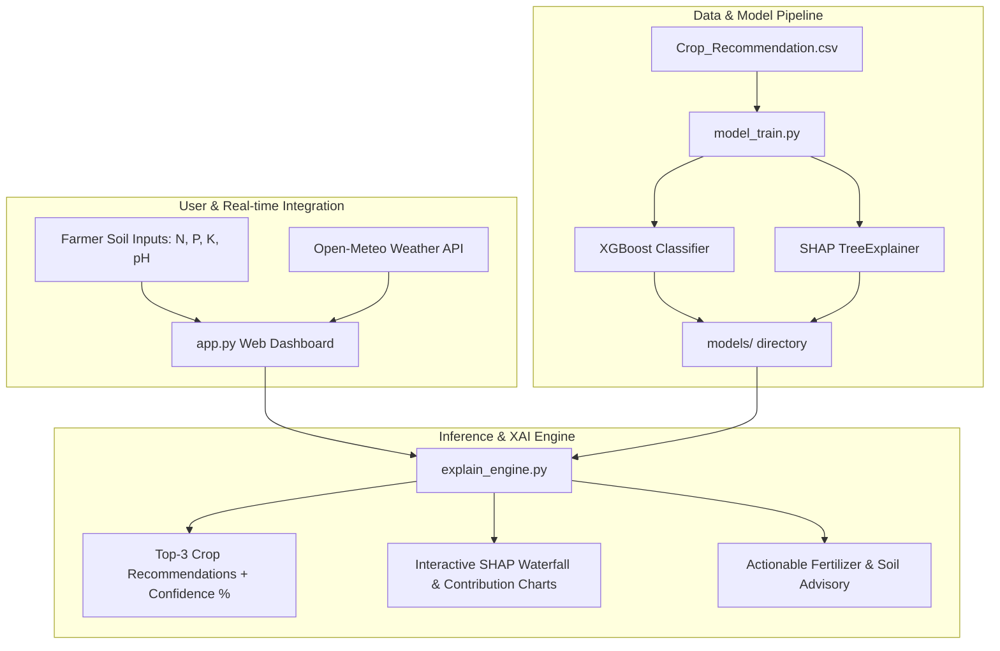

# 🌾 ExplainCrop-AI

[](https://www.python.org/)
[](https://xgboost.readthedocs.io/)
[](https://shap.readthedocs.io/)
[](https://streamlit.io/)
[](https://open-meteo.com/)
[](https://opensource.org/licenses/MIT)

> **ExplainCrop-AI** is an Explainable AI (XAI) Precision Agriculture platform that recommends the most suitable crops for agricultural soil and environmental conditions. It combines high-accuracy **XGBoost multi-class classification**, **SHAP (SHapley Additive exPlanations)** factor attribution, and **live real-time weather integration** with actionable agronomic advisories.

---

## 🌟 Key Features

- 🎯 **High-Accuracy Crop Recommendation**: Multi-class XGBoost classifier predicting across **22 crops** with **>99% accuracy**.
- 🔍 **Explainable AI (SHAP)**: Local and global SHAP feature attribution charts explaining *why* Nitrogen, Phosphorus, Potassium, Temperature, Humidity, pH, or Rainfall impacted each decision.
- 🌦️ **Real-Time Weather Intelligence**: 1-click global weather lookup (temperature, humidity, seasonal rainfall) via the Open-Meteo Geocoding & Weather API.
- 🚜 **Actionable Farmer Advisory**: Customized fertilizer suggestions (Urea, DAP, MOP), pH amendments (agricultural lime / gypsum), and irrigation schedules.
- 📊 **Model Analytics & Validation**: Interactive Confusion Matrix, benchmark comparisons (Random Forest, Decision Tree, SVM), and global feature importance.
- 🧪 **Soil Type Presets**: Quick-fill buttons for Alluvial, Black Cotton, Red Loam, and Sandy soils.

---

## 🏗️ System Architecture



---

## 📦 Dataset Overview

The dataset contains **2,200 agricultural samples** across 22 crops with 7 soil and climate parameters:

| Feature | Description | Unit / Range |
| :--- | :--- | :--- |
| **N** | Ratio of Nitrogen content in soil | $0 - 150$ |
| **P** | Ratio of Phosphorus content in soil | $5 - 150$ |
| **K** | Ratio of Potassium content in soil | $5 - 210$ |
| **Temperature** | Ambient temperature | $8.8^\circ\text{C} - 43.7^\circ\text{C}$ |
| **Humidity** | Relative air humidity | $14.3\% - 99.9\%$ |
| **pH Value** | Soil acidity / alkalinity scale | $3.5 - 9.9$ |
| **Rainfall** | Annual / seasonal rainfall | $20.2\text{ mm} - 298.6\text{ mm}$ |

**Crops Supported (22)**:
*Rice, Maize, Chickpea, Kidneybeans, Pigeonpeas, Mothbeans, Mungbean, Blackgram, Lentil, Pomegranate, Banana, Mango, Grapes, Watermelon, Muskmelon, Apple, Orange, Papaya, Coconut, Cotton, Jute, Coffee.*

---

## 🚀 Quickstart & Installation

### 1. Clone the Repository
```bash
git clone https://github.com/Vinesh-Raja07/ExplainCrop-AI.git
cd ExplainCrop-AI
```

### 2. Set Up Virtual Environment (Recommended)
```bash
python -m venv venv

# On Windows:
venv\Scripts\activate

# On macOS/Linux:
source venv/bin/activate
```

### 3. Install Dependencies
```bash
pip install -r requirements.txt
```

### 4. Train the Model & Generate SHAP Artifacts
```bash
python src/model_train.py
```

### 5. Launch the Web Application
```bash
streamlit run app.py
```
Open your browser at `http://localhost:8501`.

---

## 📁 Repository Structure

```
ExplainCrop-AI/
├── Crop_Recommendation.csv       # Benchmark agricultural dataset
├── app.py                         # Interactive Streamlit Web Application
├── requirements.txt               # Dependencies
├── README.md                      # Documentation
├── .gitignore                     # Git ignore configuration
├── src/
│   ├── __init__.py
│   ├── model_train.py             # Model training, benchmarking & SHAP export
│   ├── explain_engine.py          # Inference, SHAP calculation & agronomic advice
│   └── weather_service.py         # Open-Meteo live weather integration
└── models/                        # Serialized ML artifacts
    ├── xgboost_crop_model.joblib  # Trained XGBoost classifier
    ├── label_encoder.joblib       # Crop class encoder
    ├── shap_explainer.joblib      # SHAP TreeExplainer
    ├── shap_background.joblib     # Background reference data
    ├── crop_profiles.json         # Crop physiological benchmarks
    └── metadata.json              # Confusion matrix & benchmark metrics
```

---

## 🏆 Model Benchmarks

| Model | Accuracy | Precision | Recall | F1-Score |
| :--- | :---: | :---: | :---: | :---: |
| **XGBoost (Selected)** | **99.32%** | **0.9935** | **0.9932** | **0.9932** |
| Random Forest | 98.86% | 0.9892 | 0.9886 | 0.9885 |
| SVM (RBF) | 97.95% | 0.9810 | 0.9795 | 0.9793 |
| Decision Tree | 97.27% | 0.9740 | 0.9727 | 0.9725 |

---

## 📜 License

Distributed under the **MIT License**. See `LICENSE` for more information.

---

## 👨‍💻 Author

**Vinesh Raja**  
- GitHub: [@Vinesh-Raja07](https://github.com/Vinesh-Raja07)
- Repository: [ExplainCrop-AI](https://github.com/Vinesh-Raja07/ExplainCrop-AI)
